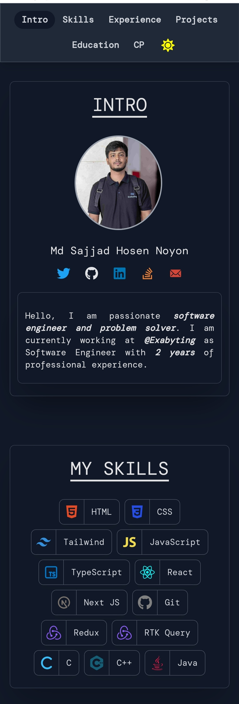
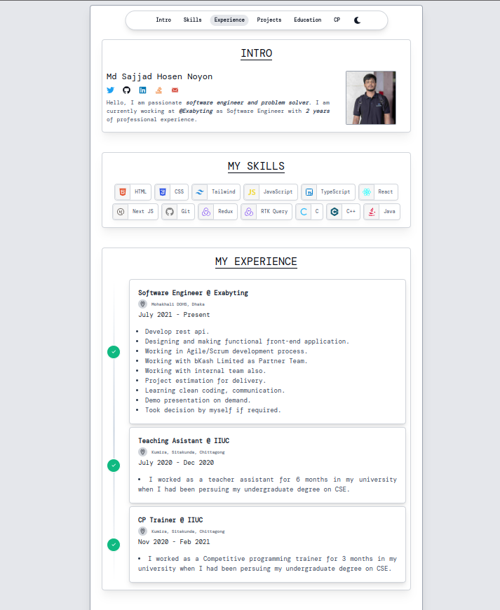
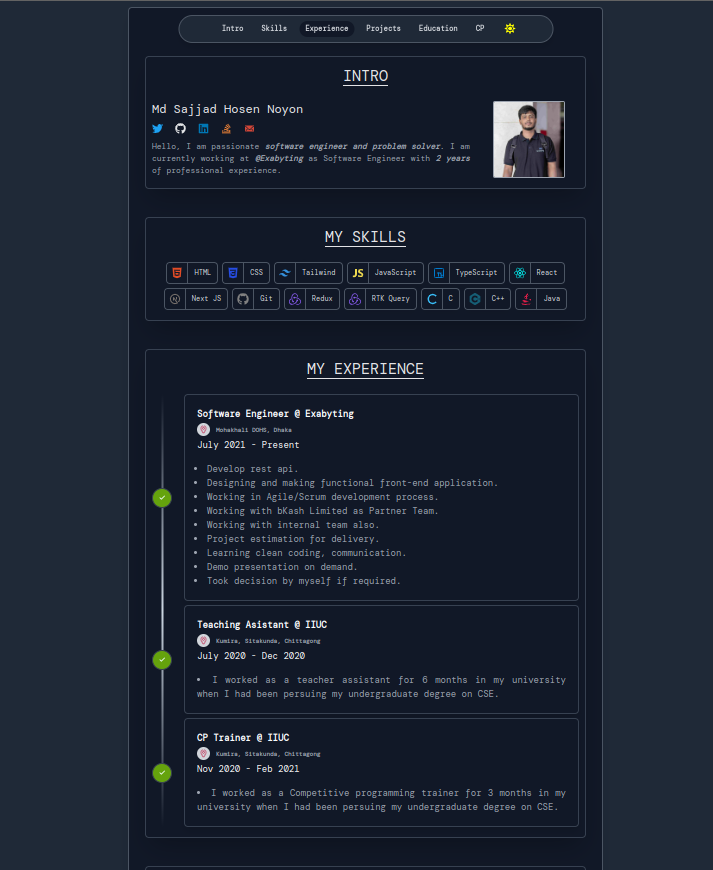

My personal portfolio built with [Next.js-14](https://nextjs.org/), [React-18](https://react.dev/) & [tailwind CSS](https://tailwindcss.com/),

## Description

- Server Side Rendered with Next-14
- Client Side Rendered for React Context
- Used Typescript for fully typesafe
- 100% Search Engine Optimize
- Use Tailwind CSS for designing
- Dark Mode available

## Getting Started

First, running scripts:

```bash
# install dependencies
yarn

# serve in dev mode, with hot reload at localhost:3000
npm run dev

# build for production
yarn dev

# serve in production mode
pnpm dev
```

Open [http://localhost:3000](http://localhost:3000) with your browser to see the result.

## Images

## Mobile Preview

<p align="center">
  <a href="https://noyon-next-portfolio.vercel.app/" target="_blank">
    
  </a>
</p>

<p align="center">
  <a href="https://noyon-next-portfolio.vercel.app/" target="_blank">
    
    
  </a>
</p>

## Live Demo

### Hosted on Vercel [https://noyon-next-portfolio.vercel.app/](https://noyon-next-portfolio.vercel.app/)
